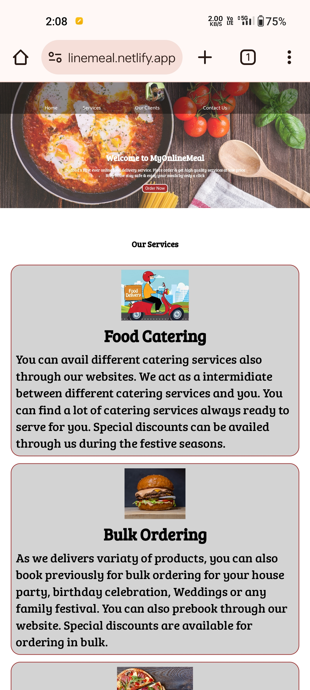
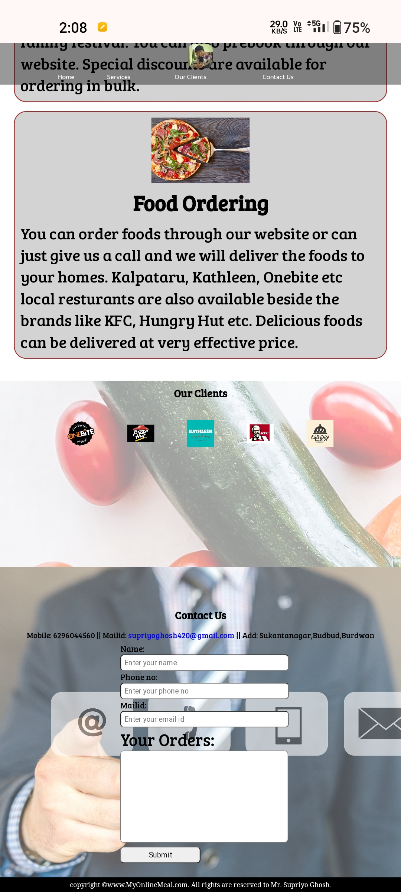
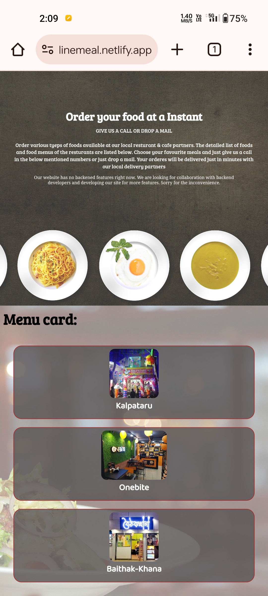

# Online Food Delivery Site:
This project is a mobile-responsive frontend website for online food ordering.  

### Live site: [myyonlinemeal.netlify.app](https://myyonlinemeal.netlify.app/)
Wait for a moment after clicking the link (it may take some time to load as it is not maintained now).

## Screenshots
|  |  |  |
| :-------------: | :-------------: | :-------------:  |

## Installation:
### 1.Clone the repository:
```bash
git clone https://github.com/Supriyo02/Insignia.23.git
```

### 2.Open the index.html file:
```bash
cd Insignia.23
open index.html
```

## Key Features:
* Food Catering: Simulates the ability to inquire about catering services.
* Instant Food Ordering: Mimics the process of placing an instant food order.
* Bulk Ordering: Offers a frontend interface for bulk order inquiries.
* Enquiry Form: Provides a user-friendly form for submitting inquiries.
* Mobile Responsive Design: Ensures the website adapts seamlessly for mobile devices.

* Note: It showcases various functionalities but does not implement actual ordering or business logic (backend).   

## Technologies Used:
* HTML
* CSS

## Contributing:
Feel free to fork the repository and suggest improvements. Please create a new branch for any changes you make.
